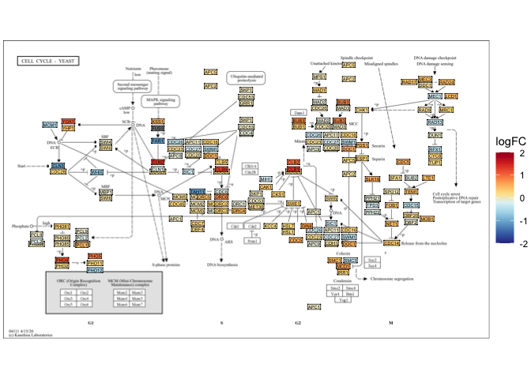

<!-- README.md is generated from README.Rmd. Please edit that file -->

# Paralogs

<!-- badges: start -->
<!-- badges: end -->

“Paralogs” is an innovative R package designed to enhance the analysis
of gene expression data in KEGG pathways by visualizing the differential
expression of all genes within KEGG nodes. Unlike traditional methods
that collapse the expression levels of these genes, “Paralogs” maintains
gene-level specificity, revealing nuanced regulatory and functional
distinctions.

## Features

- **Gene-Level Visualization**: Visualize differential expression data
  for each gene within KEGG pathways.
- **Integration with Bioinformatics Tools**: Seamlessly works with
  popular R bioinformatics packages like DESeq2, edgeR, and limma.
- **Customizable Outputs**: Offers flexible customization options for
  your visualizations to meet diverse research needs.

## Installation

You can install the development version of Paralogs from
[GitHub](https://github.com/) with:

``` r
# install.packages("devtools")
devtools::install_github("clstacy/Paralogs")
```

## Example

Here’s how to get started with the “Paralogs” package:

``` r
library(Paralogs)

# load example data
gene_data <- data()
pathway_data <- data()

# Generate plots for paralogs
plotParalogs(gene_data, pathway_data)
```

<!-- What is special about using `README.Rmd` instead of just `README.md`? You can include R chunks like so: -->
<!-- ```{r cars} -->
<!-- summary(cars) -->
<!-- ``` -->
<!-- You'll still need to render `README.Rmd` regularly, to keep `README.md` up-to-date. `devtools::build_readme()` is handy for this. -->

The above example generates the resulting plot:

    #> 
    #> Loading required package: AnnotationDbi
    #> Loading required package: stats4
    #> Loading required package: BiocGenerics
    #> 
    #> Attaching package: 'BiocGenerics'
    #> The following objects are masked from 'package:stats':
    #> 
    #>     IQR, mad, sd, var, xtabs
    #> The following objects are masked from 'package:base':
    #> 
    #>     anyDuplicated, aperm, append, as.data.frame, basename, cbind,
    #>     colnames, dirname, do.call, duplicated, eval, evalq, Filter, Find,
    #>     get, grep, grepl, intersect, is.unsorted, lapply, Map, mapply,
    #>     match, mget, order, paste, pmax, pmax.int, pmin, pmin.int,
    #>     Position, rank, rbind, Reduce, rownames, sapply, setdiff, sort,
    #>     table, tapply, union, unique, unsplit, which.max, which.min
    #> Loading required package: Biobase
    #> Welcome to Bioconductor
    #> 
    #>     Vignettes contain introductory material; view with
    #>     'browseVignettes()'. To cite Bioconductor, see
    #>     'citation("Biobase")', and for packages 'citation("pkgname")'.
    #> Loading required package: IRanges
    #> Loading required package: S4Vectors
    #> 
    #> Attaching package: 'S4Vectors'
    #> The following object is masked from 'package:utils':
    #> 
    #>     findMatches
    #> The following objects are masked from 'package:base':
    #> 
    #>     expand.grid, I, unname
    #> 
    #> 
    #> Attaching package: 'dplyr'
    #> The following object is masked from 'package:AnnotationDbi':
    #> 
    #>     select
    #> The following objects are masked from 'package:IRanges':
    #> 
    #>     collapse, desc, intersect, setdiff, slice, union
    #> The following objects are masked from 'package:S4Vectors':
    #> 
    #>     first, intersect, rename, setdiff, setequal, union
    #> The following object is masked from 'package:Biobase':
    #> 
    #>     combine
    #> The following objects are masked from 'package:BiocGenerics':
    #> 
    #>     combine, intersect, setdiff, union
    #> The following objects are masked from 'package:stats':
    #> 
    #>     filter, lag
    #> The following objects are masked from 'package:base':
    #> 
    #>     intersect, setdiff, setequal, union
    #> Loading required package: DOSE
    #> 
    #> DOSE v3.28.2  For help: https://yulab-smu.top/biomedical-knowledge-mining-book/
    #> 
    #> If you use DOSE in published research, please cite:
    #> Guangchuang Yu, Li-Gen Wang, Guang-Rong Yan, Qing-Yu He. DOSE: an R/Bioconductor package for Disease Ontology Semantic and Enrichment analysis. Bioinformatics 2015, 31(4):608-609



## Contributing

Contributions to “Paralogs” are welcome! Please reach out for details on
the process for submitting pull requests to us.

## License

This project is licensed under the MIT License - see the LICENSE.md file
for details.

## Citation

If you use “Paralogs” in your research, please cite:

Stacy, C and Lewis, J. (2024). Paralogs: An R Package for Visualizing
Differential Expression of Paralogs in KEGG Gene Pathways. GitHub
repository, <https://github.com/clstacy/Paralogs>

## Contact

For questions and feedback, please reach out to me at
clstacy.stat\[at\]gmail.com.
